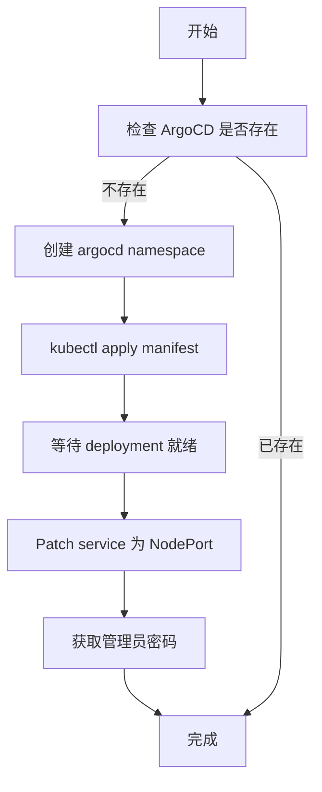
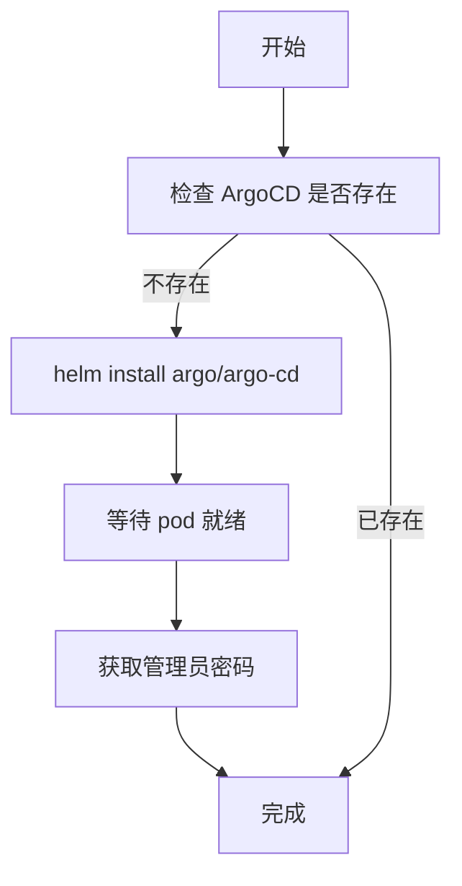

# ArgoCD 安装方式配置指南

## 问题背景

在某些环境下，使用 Helm Chart 安装 ArgoCD 可能会遇到 Pod 崩溃问题：

```bash
# Pod 状态异常
NAME                              READY   STATUS              RESTARTS   AGE
argocd-server-xxx                 0/1     CrashLoopBackOff    6          8m

# 查看日志显示
exec /usr/bin/tini: exec format error
```

**根本原因**: Helm Chart 版本或配置与环境不完全兼容，导致容器启动失败。

---

## 解决方案：灵活的安装方式

我们的 Ansible Playbook 现在支持两种 ArgoCD 安装方式，可以轻松切换：

### 方法 1：修改全局配置文件（推荐）✅

编辑 `group_vars/all.yml`：

```yaml
# ArgoCD 安装方式选择
# - 'manifest': 使用官方 kubectl manifest（推荐，稳定性好）
# - 'helm': 使用 Helm Chart（某些环境可能有兼容性问题）
argocd_install_method: "manifest"  # 改为 "helm" 可切换到 Helm 方式
```

### 方法 2：命令行参数

```bash
# 使用 manifest 方式（推荐）
ansible-playbook playbooks/04-helm-deploy.yml \
  -e "argocd_install_method=manifest"

# 使用 helm 方式
ansible-playbook playbooks/04-helm-deploy.yml \
  -e "argocd_install_method=helm"
```

---

## 两种安装方式对比

| 特性 | Manifest 方式 | Helm 方式 |
|------|--------------|----------|
| **稳定性** | ⭐⭐⭐⭐⭐ 官方支持，稳定可靠 | ⭐⭐⭐ 可能有兼容性问题 |
| **版本管理** | ⭐⭐⭐ 使用 stable 版本 | ⭐⭐⭐⭐⭐ 可指定精确版本 |
| **配置灵活性** | ⭐⭐⭐ 需要手动 patch | ⭐⭐⭐⭐⭐ 通过 values 配置 |
| **回滚能力** | ⭐⭐ kubectl 手动回滚 | ⭐⭐⭐⭐⭐ helm rollback |
| **部署速度** | ⭐⭐⭐⭐ 快速 | ⭐⭐⭐ 相对较慢 |
| **推荐场景** | 生产环境，快速部署 | 需要精细版本控制 |

---

## Playbook 工作流程

### Manifest 方式（默认）



### Helm 方式



---

## 配置文件详解

### `group_vars/all.yml` - 全局配置

```yaml
# ArgoCD 安装方式
argocd_install_method: "manifest"  # 或 "helm"

# 命名空间
platform_namespace: platform       # Harbor, Cert-Manager
argocd_namespace: argocd          # ArgoCD 专用命名空间

# 端口配置
argocd_http_nodeport: 30003       # ArgoCD HTTP 端口
argocd_https_nodeport: 30443      # ArgoCD HTTPS 端口

# Manifest 方式配置
argocd_manifest_url: "https://raw.githubusercontent.com/argoproj/argo-cd/stable/manifests/install.yaml"

# Helm 方式配置
argocd_chart_version: "5.51.6"    # Chart 版本
```

---

## 运行示例

### 首次部署

```bash
cd ~/Workspace/gitops-infra/ansible

# 使用默认配置（manifest 方式）
~/.conda/bin/ansible-playbook playbooks/04-helm-deploy.yml

# 或指定使用 helm 方式
~/.conda/bin/ansible-playbook playbooks/04-helm-deploy.yml \
  -e "argocd_install_method=helm"
```

### 切换安装方式

如果已经用 Helm 方式安装，想切换到 Manifest 方式：

```bash
# 1. 先卸载现有的 ArgoCD
multipass exec vm1 -- bash -c '
  export KUBECONFIG=/etc/rancher/k3s/k3s.yaml
  kubectl delete namespace argocd
'

# 2. 修改配置文件
vim group_vars/all.yml
# 将 argocd_install_method 改为 "manifest"

# 3. 重新运行 playbook
~/.conda/bin/ansible-playbook playbooks/04-helm-deploy.yml
```

---

## 验证部署

### 检查 Pod 状态

```bash
# 查看所有 ArgoCD pods（应该都是 Running）
multipass exec vm1 -- bash -c '
  export KUBECONFIG=/etc/rancher/k3s/k3s.yaml
  kubectl get pods -n argocd
'

# 预期输出（所有 pod 应该是 1/1 Running）:
NAME                                                READY   STATUS    RESTARTS   AGE
argocd-applicationset-controller-xxx                1/1     Running   0          5m
argocd-notifications-controller-xxx                 1/1     Running   0          5m
argocd-repo-server-xxx                              1/1     Running   0          5m
argocd-server-xxx                                   1/1     Running   0          5m
argocd-redis-xxx                                    1/1     Running   0          5m
argocd-dex-server-xxx                               1/1     Running   0          5m
argocd-application-controller-0                     1/1     Running   0          5m
```

### 获取访问信息

```bash
# 执行快速访问脚本
multipass exec vm1 -- /tmp/platform-access.sh

# 手动获取密码
multipass exec vm1 -- bash -c '
  export KUBECONFIG=/etc/rancher/k3s/k3s.yaml
  kubectl get secret argocd-initial-admin-secret \
    -n argocd -o jsonpath="{.data.password}" | base64 -d
'
```

---

## 故障排查

### Pod 崩溃（CrashLoopBackOff）

**症状**:
```bash
argocd-server-xxx   0/1   CrashLoopBackOff   5   3m
```

**诊断**:
```bash
# 查看 Pod 日志
kubectl logs argocd-server-xxx -n argocd

# 如果看到 "exec format error"
# 解决: 切换到 manifest 安装方式
```

### Helm 安装卡住

**症状**:
```bash
TASK [Deploy ArgoCD with Helm] 
<waiting for command to exit timed out after 600 seconds>
```

**解决**:
```bash
# 1. 停止 playbook (Ctrl+C)
# 2. 检查 pods 状态
kubectl get pods -n argocd
# 3. 如果 pods 异常，卸载重装
helm uninstall argocd -n argocd
# 4. 切换到 manifest 方式
```

### 命名空间卡在 Terminating

**解决**:
```bash
kubectl get namespace argocd -o json | \
  jq ".spec.finalizers = []" | \
  kubectl replace --raw /api/v1/namespaces/argocd/finalize -f -
```

---

## 最佳实践

### 1. 选择安装方式的建议

- **生产环境**: 推荐使用 **manifest** 方式
  - 稳定性最高
  - 官方持续维护
  - 问题最少

- **开发/测试环境**: 可以尝试 **helm** 方式
  - 需要频繁版本切换
  - 需要自定义配置
  - 有 Helm 运维经验

### 2. 版本管理

```yaml
# Manifest 方式 - 使用特定版本
argocd_manifest_url: "https://raw.githubusercontent.com/argoproj/argo-cd/v2.9.3/manifests/install.yaml"

# Helm 方式 - 锁定版本
argocd_chart_version: "5.51.6"
```

### 3. 备份重要信息

```bash
# 备份 ArgoCD 配置
kubectl get configmap argocd-cm -n argocd -o yaml > argocd-cm-backup.yaml

# 备份管理员密码
kubectl get secret argocd-initial-admin-secret -n argocd -o yaml > argocd-secret-backup.yaml
```

### 4. 监控健康状态

```bash
# 创建健康检查脚本
cat > check-argocd.sh << 'EOF'
#!/bin/bash
echo "Checking ArgoCD health..."
kubectl get pods -n argocd
kubectl get svc -n argocd
kubectl top pods -n argocd 2>/dev/null || echo "Metrics not available"
EOF
chmod +x check-argocd.sh
```

---

## 快速参考

| 任务 | 命令 |
|------|------|
| 查看安装方式 | `grep argocd_install_method group_vars/all.yml` |
| 切换到 manifest | `sed -i 's/argocd_install_method: "helm"/argocd_install_method: "manifest"/' group_vars/all.yml` |
| 切换到 helm | `sed -i 's/argocd_install_method: "manifest"/argocd_install_method: "helm"/' group_vars/all.yml` |
| 查看 ArgoCD pods | `kubectl get pods -n argocd` |
| 查看 ArgoCD 日志 | `kubectl logs -l app.kubernetes.io/name=argocd-server -n argocd` |
| 获取管理员密码 | `kubectl get secret argocd-initial-admin-secret -n argocd -o jsonpath="{.data.password}" \| base64 -d` |
| 重启 ArgoCD | `kubectl rollout restart deployment -n argocd` |
| 卸载 ArgoCD | `kubectl delete namespace argocd` |

---

## 相关文档

- [TROUBLESHOOTING.md](./TROUBLESHOOTING.md) - 详细的问题排查指南
- [ArgoCD 官方文档](https://argo-cd.readthedocs.io/)
- [Ansible Playbook 文档](./playbooks/README.md)

---

## 更新日志

- **2025-11-18**: 
  - 添加 manifest 和 helm 两种安装方式支持
  - 创建全局配置文件 `group_vars/all.yml`
  - 添加灵活的切换机制
  - 解决 "exec format error" 问题
